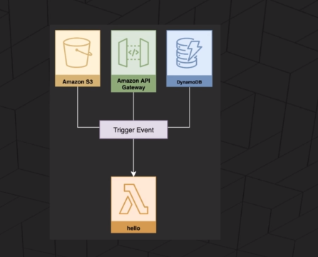
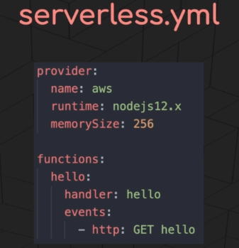

# Auction WebApp using Aws Serverless infrastructure

Tutorial: [https://www.udemy.com/course/serverless-framework/learn/lecture/19420504#overview](https://www.udemy.com/course/serverless-framework/learn/lecture/19420504#overview)

## Glossary

- [Amazon API Gateway](https://docs.aws.amazon.com/apigateway/latest/developerguide/welcome.html)

Amazon API Gateway is an AWS service for creating, publishing, maintaining, monitoring, and securing REST, HTTP, and WebSocket APIs at any scale. API developers can create APIs that access AWS or other web services, as well as data stored in the AWS Cloud. As an API Gateway API developer, you can create APIs for use in your own client applications. Or you can make your APIs available to third-party app developers. For more information, see Who uses API Gateway?.

- [Serverless Architecture](https://en.wikipedia.org/wiki/Serverless_computing)

Serverless computing is a cloud computing execution model in which the cloud provider runs the server, and dynamically manages the allocation of machine resources. Pricing is based on the actual amount of resources consumed by an application, rather than on pre-purchased units of capacity.[1] It can be a form of utility computing.

**No need to worry scaling, You can also comibine server application with serverless app.**

- [Serverless Framework](https://www.serverless.com/)
  - (**FaaS**) The building block for servlerss are functions
  - (**Event Triggers**)

  
  - serverless.yml
  
  